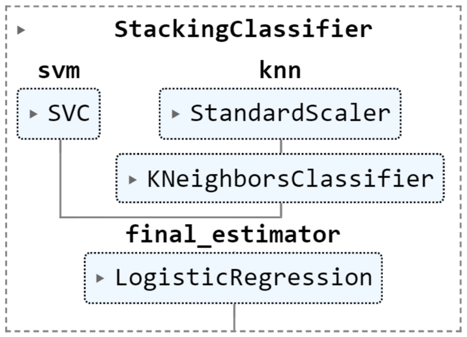

# Asteroid Classification

### Members
#### Tiago de Sousa Rodrigues - Q00118
#### Yeo Shi Lee Tan - E13329

### Local Setup

To install dependencies, run:

```
pip install -r requirements.txt
```

Or run the first cell of the Jupyter notebook file:

```
pip install git+https://github.com/rodrigues177/Q00118.git@main
```

## Introduction
To **gain insights into the characteristics** of asteroids that could potentially impact Earth and to analyze this data and identify patterns and trends that can **inform recommendations for monitoring and preventing potentially hazardous asteroid impacts**.

## Methods
### Exploratory Data Analysis:
Check Balance of Dataset:
* Imbalanced
* 5x more non-hazardous asteroids than hazardous asteroids
* Important to know so that we can train our machine learning models to take this into account


Pre-Processing Data:
* Normalized the dataset
* Removed same features of differing units
* Removed features regarding identification/timing
* Important to know so that we can reduce processing time when training model


  
Correlation:
* Conducted a heatmap and pairplot to see correlation
* Important to know the relationships amongst the variables
  

  
We found three main correlated groups (in descending order):
* Jupiter Tisserand Invariant, Mean Motion, Aphelion Distance, Orbital Period, Semi Major Axis (~0.9)
* Eccentricity, Aphelion Distance (~0.7)
* Absolute Magnitude, Estimated Diameter in Km (max) (~0.6)
 

  
### Machine Learning Models:

As model quality metrics, we mainly used two:

- Area Under the Curve - is one of the best measures in highly unbalanced datasets like ours.
- F1-Score - whenever the model at hand did not calculate probabilites (ex: SVM, kNN). In this type of models, the ROC curve is flat and AUC is a bad measure.

With probabilities as output we can define a threshold different to 0.5. In our case, classifying a threatful asteroid as non-hazardous (a false negative) is worse then classifying as hazardous a non-threatful asteroid (false positive). Which means that we should set a threshold superior to 0.5.

As predictive models, we used 5 different model architectures:

#### Neural Network

A feed-forward fully connected artificial neural network. In the following figure is the architecture used:


We used ReLU as activation functions in the hidden layers and sigmoid in the last layer so we can get probabilities. We also used ADAM to get a faster training and "binary_crossentropy" as loss function since it is the most indicated to binary classification (and was the one from which we got the best results). We used 100 epochs (which were needed to get from a very good model to a near perfect model).

#### kNN

We tested from 1 to 10 neighbours to see which one got the best F1-Score. For that we used the same train-test split and used the F1-Score of the test set as deciding factor. 3 neighbours was chosen as best. 

We also applied StandardScaler to the data before using it.

#### SVM

We did Cross Validation to test what was the best kernel to use in the SVM. "poly" won as the best kernel.

#### Bagging SVM

A standard bagging model, using the SVM with "poly" kernel as estimator. 

#### Stacking Classifier

In the following figure is the Stacking Classifier architecture used:



We used our best kNN (with 3 neighbours) and SVM (with "poly" as kernel). Our final estimator is a logistic regression, because it outputs probabilities instead of only classifications. With probabilities we can plot the ROC curve and change the threshold (in our case, a false negative is worse then a false positive).

## Experimental Design
**Permutation Importance:**
* Defined to be the decrease in a model score when a single feature value is randomly shuffled
* Purpose is to see which feature in the model is most important in determining whether an asteroid is hazardous or not
* The higher the score of permutation importance, the more important the feature is in the model

## Results

### Predictive Models

The following table resumes our findings:


From the non Neural Network models, the Stacking Classifier got the best score. The Stacking Classifier is not as good as the Neural Network, but takes less then 1% of the time that the Neural Network takes to train and is only slighly worse. Even if we train the Neural Network in a small number of epoch (ex: 15), it takes more time to train and the result is practically the same in terms of AUC/F1-Score.

The Stacking Classifier compared to the other weak classifiers has a simultaneously higher Precision and Recall (and thus a higher F1-Score and Accuracy). Other less obvious advantage is that it outputs probabilities instead of only a 0-1 classification. It takes twice the time of the weak models to train.

### Insights

We proceded to estimate what features are mainly driving the predictions in our models.

The **most important features** are, in descending order:
* Minimum Orbit Intersection, with a score of 0.223
* Absolute Magnitude, with a score of 0.176


This can be attributed to the fact that as stated from the Center for Near Earth Object Studies website, "Potentially Hazardous Asteroids (PHAs) are currently defined based on parameters that measure the asteroid's potential to make threatening close approaches to the Earth. Specifically, all asteroids with an Earth Minimum Orbit Intersection Distance (MOID) of 0.05 au or less and an absolute magnitude (H) of 22.0 or less are considered PHAs.". Our results align with this such that the two main defining features of our model to whether an asteroid is hazardous or not are the minimum orbit intersection and absolute magnitude.

## Conclusions

### Take-away Points

When monitoring and preventing potentially hazardous asteroid impacts, based on our results, scientists can collect the data of and look into two main features of asteroids - the Minimum Orbit Intersection and Absolute Magnitude. With these values, we will be able to determine whether they are hazardous or not. 

We also developed 2 predictive models that work well with this type of data: a artificial neural network (which takes some time to train but is a near-perfect classifier) and a stacking model (which is good and fast). This models could be applied in a real world setting to filter down the number of asteroid threats that should be thoroughly analysed by an astronomer."

### Future Work

There are still lingering questions left unanswered:
* What values of Minimum Orbit Intersection and Absolute Magnitude will lead to an asteroid being hazardous?
* Why do these features determine whether an asteroid is hazardous?

To look into this, we can train our model more with a larger dataset with a focus of more varied values of the two features. This way we can predict a potential minimum value for each feature to which an asteroid can be considered hazardous.
